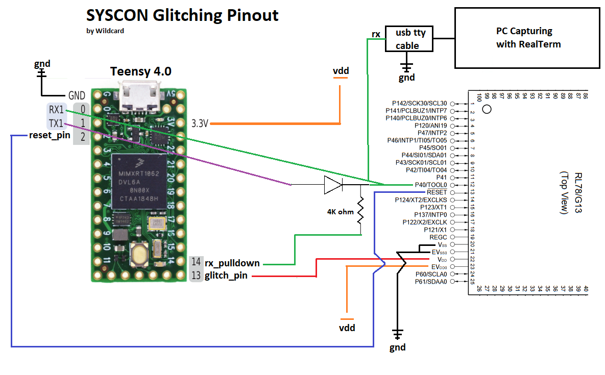
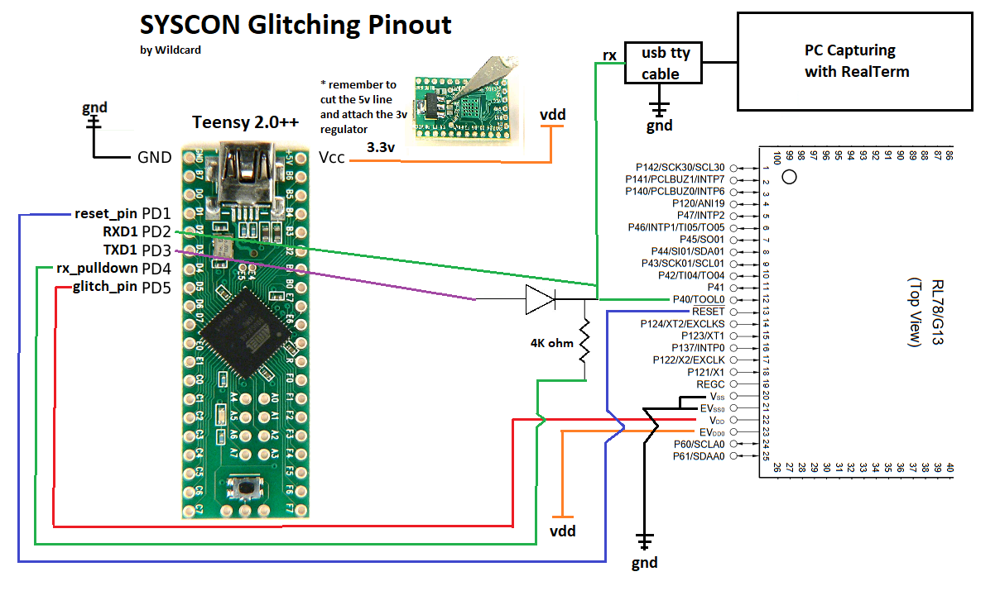

# SYSGLITCH
A tool for glitching the on-chip debugger rom located in RL78 devices in order to dump full flash contents

Only compatible with version 3.03 of the OCD rom.

Based on the attack outlined by Fail0verflow https://fail0verflow.com/blog/2018/ps4-syscon/

## Setup
- A Teensy 4.0 or Teesny 2.0++ and the Arduino IDE
- *If using the 2.0++ make sure it is fitted with a 3.3v regulator as instructed at https://www.pjrc.com/teensy/3volt.html
- A usb serial cable wired to a PC, capturing raw data on RX with Realterm https://sourceforge.net/projects/realterm/
- An RL78 with version 3.03 of the OCD rom
- A small diode and ~4K ohm resistor for the RX line pulldown(needed to stabilise signal on syscon TOOL0)

## Teensy 4.0 Glitching Pinout

## Teensy 2.0++ Glitching Pinout

## Vita RL78 Pinout

## Credits:
- Fail0verflow for the initial Writeup on the attack.
- droogie for early syscon investigations.
- juansbeck for his findings on identifying the chip and pinout. 
- Zecoxao, M4j0r, and SSL for their support in all syscon related work.

